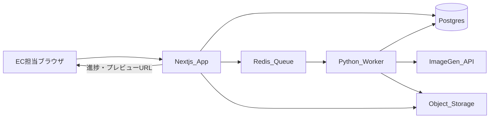
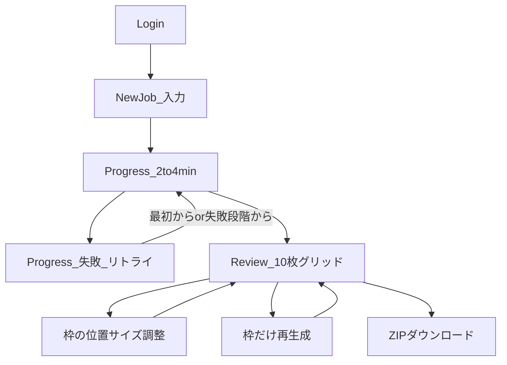
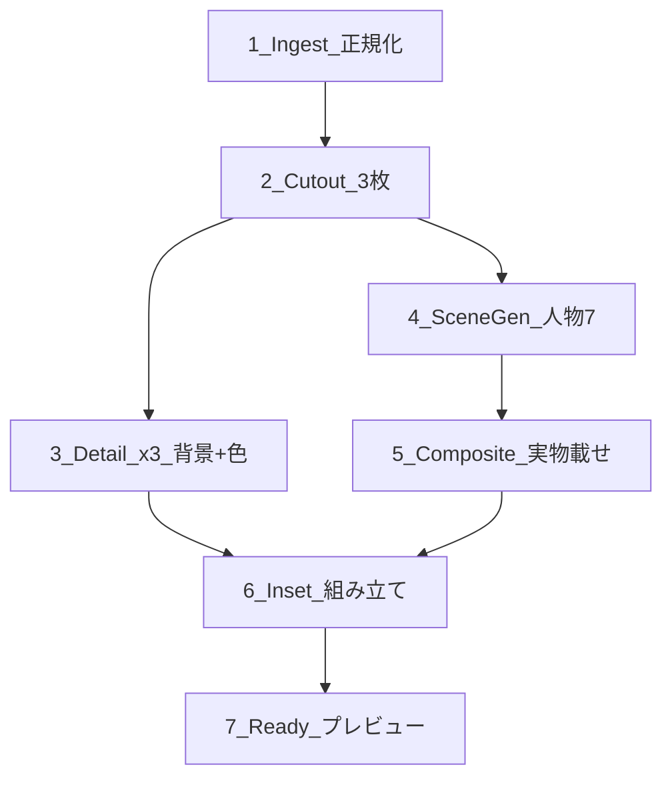

# 設計（画面フロー・処理パイプライン）

要件の正本は [REQUIREMENTS.md](REQUIREMENTS.md)。本書はその実装設計です。

## 技術スタック（確定）

| 層 | 採用 |
|---|---|
| 画面・API・認証 | **Next.js**（App Router） |
| メタデータ正本 | **Postgres**（Job / JobAsset / Preset。ORM は Prisma 等で可） |
| 重い処理 | **Python ワーカー**（切り抜き・色調整・合成・ZIP） |
| 人物シーン生成 | **fal.ai**（`fal-ai/flux/dev` で参照顔 → `fal-ai/flux-pulid` で7シーン。`FAL_KEY` なし時はローカル仮） |
| 切り抜き | ワーカー内の専用モデル（**BiRefNet / rembg**） |
| 合成 | 自前（Pillow / OpenCV）。影・色温度は地金に合わせて軽く整える |
| ジョブキュー | **Redis + RQ**（同等でも可）。キュー用途のみ。履歴の正本は Postgres |
| 保存 | **S3 互換**（ローカルは MinIO またはローカルディスク） |
| 認証 | 共有社内ログイン（NextAuth Credentials） |
| 進捗通知 | **3〜5 秒間隔のポーリング**（SSE/WebSocket は後回し可） |

## システム構成



- **正のデータ源:** Postgres（ジョブ状態・メタデータ・枠の transform）  
- **Redis:** キュー投入・ワーカー起動のみ  
- **オブジェクトストレージ:** 入力画像・中間成果物・プレビュー画像  

## 画面フロー



### 1. ログイン

- 共有 ID / パスワード（環境変数）
- 未ログインはすべてリダイレクト
- ブランド名「Ti amo Jewelry Studio」をヒーロー級で出す

### 2. 新規ジョブ（1 画面）

必須:

- 商品画像 3 枚（順序＝ディテール 1〜3）
- メイン写真の選択（サムネイル操作で切替）
- カテゴリ / 地金（YG・WG・PG）
- 人物プリセット 1 人
- 背景プリセット 1 つ
- 全身トーンちょうど 2 つ（「2/2」表示。上限時は他を disabled 風）

任意（レビューでも可）:

- インセットに使うディテール枠（未選択時はディテール 1）

UI 契約:

- 必須が欠けている間は生成ボタンを disabled にし、不足項目の案内を出す
- カテゴリ選択時に着用部位のヒントを出す（例: 「着用シーンでは腕まわりを写します」）
- フォームは `label` と入力の対応、必須は `aria-required` 等で明示する（実装時）

アップロード検証（サーバ側）:

- 許可形式（例: JPEG / PNG / WebP）とサイズ上限を検証。不正ならジョブ作成を拒否

### 3. 進捗

段階: `切り抜き → ディテール → 人物シーン → 合成 → 仕上げ`  
目安 2〜4 分。クライアントはジョブ状態 API を 3〜5 秒間隔でポーリング。

失敗時:

- 失敗した段階名を表示
- 「最初からリトライ」「失敗した段階からリトライ」を出す
- 途中成果物の先出し表示は v1 対象外

### 4. レビュー（中核）

- 10 枠を役割ラベル付きで表示
- 各枠: 再生成はボタン形状。実行前に軽い確認
- 着用系は画像上でドラッグして大きさ・位置を調整（人物は再生成しない）。角度の自動補正はしない
- インセット枠: ディテール選択の組み直し
- ZIP ダウンロード

### 5. プリセット管理

- 初期シード: 人物 3・背景 4・トーン 4
- あとから追加できる最小 CRUD（v1 後半でも可）

## 処理パイプライン（Python ワーカー）

### オーケストレーション

**1 ジョブ＝1 ワーカープロセスが 7 段階を順に実行**する。各段の成果をチェックポイントとして Postgres / ストレージに残し、失敗時はその段階から再開できる。

複数の小さな RQ ジョブに DAG 分割しない（複雑さが Phase 1〜3 に見合わないため）。



| Stage | 内容 |
|---|---|
| 1 Ingest | 正規化。メタデータ保存（category, metal, personaId, backgroundId, toneIds, mainIndex） |
| 2 Cutout | 3 枚切り抜き。失敗したらジョブ失敗（続行しない） |
| 3 Detail ×3 | 背景プリセット＋地金色調整。AI 人物なし |
| 4 Scene ×7 | 着用 4＋全身 2＋引き 1。同一 persona。ジュエリーは描かせない。**人物のみのシーン画像を中間成果物として保存** |
| 5 Composite | 実物切り抜きをカテゴリ別アンカーに配置。ネックレス／ピアスはシーンごとに顔の矩形（YuNet）から初期 transform を計算して保存（検出失敗時はゼロ＝固定アンカー）。transform 反映可。中間の人物シーンを再利用 |
| 6 Inset | 引き＋右下ディテール |
| 7 Ready | プレビュー URL。ZIP は**ダウンロード時**に打包 |

### 枠再生成

| 対象 | 再実行する Stage |
|---|---|
| ディテール | 3 のみ |
| 着用／全身 | Scene（必要時）＋ Composite。persona 維持。中間シーンがあれば Composite のみで可 |
| インセット | 6 のみ |
| 位置・サイズ確定 | Composite のみ（中間の人物シーン必須） |

### 中間データ

位置調整・Composite 単独再実行のため、Stage 4 の**人物のみシーン画像**をオブジェクトストレージに残す。これがないと単枠再生成の時間目標（数十秒〜1 分）を満たせない。

### persona 一貫性

方針（スパイク反映・2026-08-12）: **PuLID on Flux**（`fal-ai/flux-pulid`）。

1. `PresetPersona.imageKey`（参照写真の URL / ローカルパス）があればそれを顔 ID に使う  
2. 無ければ `fal-ai/flux/dev` で人物ポートレートを1枚生成して参照にする  
3. 着用・全身・引きの7枚はすべて同じ参照で PuLID 生成（プロンプトでジュエリー禁止）

実装: `apps/worker/worker/scene_gen.py`。ベンダー最終確定とコスト上限の具体値は [REQUIREMENTS.md](REQUIREMENTS.md) 未決に残す。

## データモデル（最小）

Postgres:

- `PresetPersona` / `PresetBackground` / `PresetTone`
- `Job`: status, inputs, options, stage, error, timestamps, apiCallCount 等
- `JobAsset`: slotKey, storageKey, kind（input / cutout / scene / preview 等）, transform JSON

スロットキー例: `detail_a|b|c`, `wear_office|cafe|date|holiday`, `body_1|body_2`, `wide_inset`

## 運用・非機能（薄く）

| 項目 | 方針 |
|---|---|
| 画像生成 API コスト | ジョブあたりの生成 API 呼び出しに上限を置く。具体数値はベンダー確定後 |
| API キー | ワーカー側の環境変数のみ。ブラウザや Next.js 公開バンドルに載せない |
| アップロード | サーバ側で形式・サイズを検証 |
| ログ | jobId・段階名・処理時間を必ず出す |
| テスト | 座標・合成ロジックはユニットテスト。外部 API はモック |
| 同時実行 | v1 は同時ジョブ少数（目安 1〜2）。ワーカー並列もそれに合わせる |

## 想定リポジトリ構成（本実装時）

```
apps/web/          # Next.js
apps/worker/       # Python（RQ worker）
packages/shared/   # スロット定義・ファイル名規約・カテゴリ
docker-compose.yml # Postgres, Redis, MinIO, web, worker
docs/              # 要件・設計・モック（本書含む）
```

## 実装フェーズ

| Phase | 内容 | 状態 |
|---|---|---|
| 0 | 完成形 UI モック（Tailwind 静的 HTML） | **完了** — [mockups/](mockups/)（レビュー反映済み） |
| 1 | monorepo 骨組み・認証・ジョブ CRUD・ダミー 10 枚 ZIP | **完了** — UI モック寄せ・削除・全件一覧含む |
| 2 | 切り抜き＋背景＋地金色でディテール 3 枚 | **完了** — UP＋淡色マット切り抜き＋ディテール3（ベンダー差し替えは後続可） |
| 3 | 人物シーン生成＋実物合成＋ transform | **着手中** — 合成・ドラッグ・ピアス両耳・fal.ai・影＋チルト・顔矩形配置・シーン多様化（max_sequence_length=512）済み（キーなしは仮） |
| 4 | インセット・枠再生成・進捗・プリセット追加 | 未着手 |
| 5 | 画質・リトライ・14 日削除・デプロイ固め | 未着手 |

## Phase 0 モック

- ローカル: [mockups/product-ui.html](mockups/product-ui.html)
- 公開: https://ti-amo-jewelry-studio.surge.sh
- 内容: ログイン／新規ジョブ／進捗（成功・失敗）／レビューの画面。実 API なし

## 変更履歴

| 日付 | 内容 |
|---|---|
| 2026-08-04 | 初版（画面フロー・パイプライン・フェーズ） |
| 2026-08-11 | レビュー反映: Postgres 正本、1プロセス制御、中間画像、ポーリング、失敗UI責務、運用方針 |
| 2026-08-11 | Phase 1 着手: monorepo（web / worker / shared）と docker-compose |
| 2026-08-11 | Phase 1 完了: モック寄せ UI・削除・全件一覧。Phase 2 着手 |
| 2026-08-11 | Phase 2 完了。Phase 3 着手（シーン＋合成＋transform） |
| 2026-08-12 | Phase 3: 大きさ・位置調整をスライダー→画像上ドラッグ＆リサイズに変更 |
| 2026-08-12 | Phase 3: ピアスは片耳分の1枚を自動で両耳へ鏡写し合成。左右を個別に調整可能に |
| 2026-08-12 | Phase 3: fal.ai（Flux + PuLID）人物シーン差し込み。FAL_KEY なしはローカル仮のまま |
| 2026-08-13 | Phase 3: ジュエリー合成に軽量な影合成（全カテゴリ）＋ネックレス/ピアス固定チルトを追加（`Anchor.rotate`、Python/TS 両実装を同期）。実物切り抜きは維持、AI描画・3D的な自動補正はしない方針は変更なし |
| 2026-08-13 | Phase 3: ネックレス/ピアスの初期配置を顔矩形（OpenCV YuNet）でずらす。オフセットは `JobAsset.transform` に保存するため Web 再合成は変更不要。ドラッグ上限を 1000px に拡張 |
| 2026-08-13 | Phase 3: flux-pulid の `max_sequence_length` を 512 に明示（初期値 128 だとポーズ・髪型・デート相手が切れて参照顔のコピーになっていた）。髪アップ枠は `id_weight` 0.48 |
