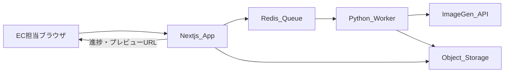
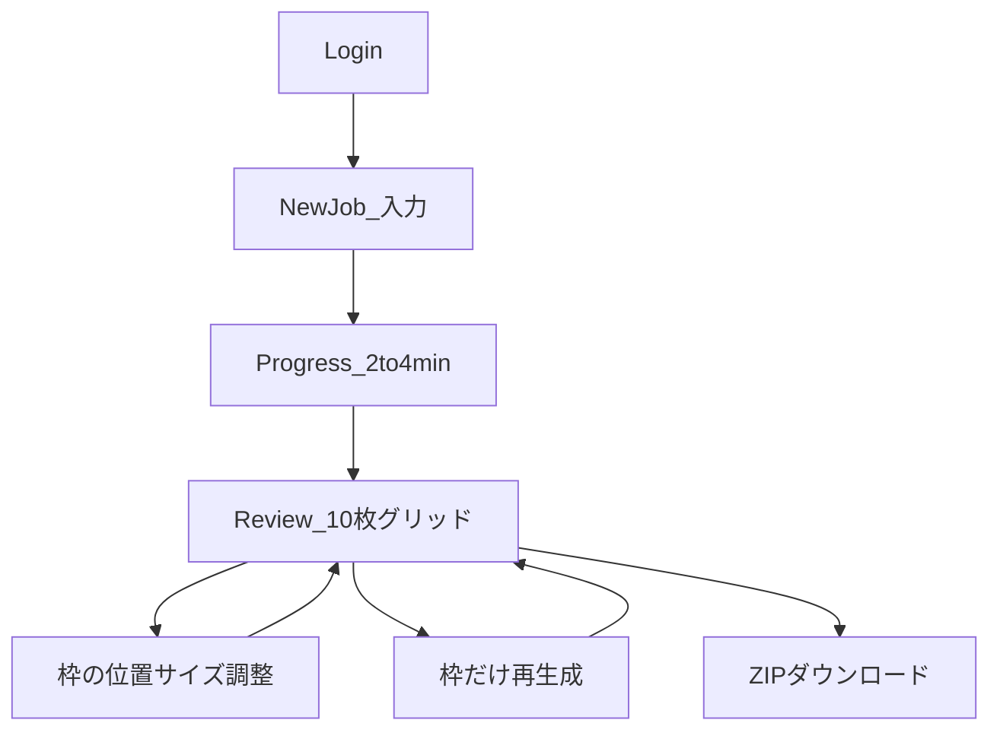
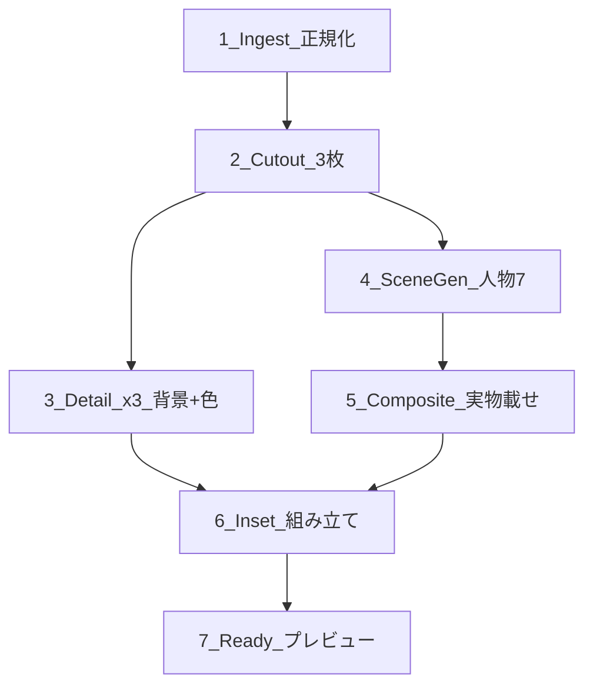

# 設計（画面フロー・処理パイプライン）

要件の正本は [REQUIREMENTS.md](REQUIREMENTS.md)。本書はその実装設計です。

## 技術スタック（確定）

| 層 | 採用 |
|---|---|
| 画面・API・認証 | **Next.js**（App Router） |
| 重い処理 | **Python ワーカー**（切り抜き・色調整・合成・ZIP） |
| 人物シーン生成 | **画像生成 API**（初期は fal.ai の Flux 系。人物のみ／ジュエリーなし） |
| 切り抜き | ワーカー内の専用モデル（**BiRefNet / rembg**） |
| 合成 | 自前（Pillow / OpenCV）。影・色温度は地金に合わせて軽く整える |
| ジョブキュー | **Redis + RQ**（同等でも可）。Next.js はジョブ投入と状態照会 |
| 保存 | **S3 互換**（ローカルは MinIO またはローカルディスク） |
| 認証 | 共有社内ログイン（NextAuth Credentials） |

## システム構成



## 画面フロー



### 1. ログイン

- 共有 ID / パスワード（環境変数）
- 未ログインはすべてリダイレクト
- ブランド名「Ti amo Jewelry Studio」をヒーロー級で出す

### 2. 新規ジョブ（1 画面）

必須:

- 商品画像 3 枚（順序＝ディテール 1〜3）
- メイン写真の選択
- カテゴリ / 地金（YG・WG・PG）
- 人物プリセット 1 人
- 背景プリセット 1 つ
- 全身トーン 2 つ

任意（レビューでも可）:

- インセットに使うディテール枠（未選択時はディテール 1）

### 3. 進捗

段階: `切り抜き → ディテール → 人物シーン → 合成 → 仕上げ`  
目安 2〜4 分。失敗時は段階名＋リトライ。

### 4. レビュー（中核）

- 10 枠を役割ラベル付きで表示
- 各枠: 再生成。着用系は大きさ・位置スライダー（人物は再生成しない）
- インセット枠: ディテール選択の組み直し
- ZIP ダウンロード

### 5. プリセット管理

- 初期シード: 人物 3・背景 4・トーン 4
- あとから追加できる最小 CRUD（v1 後半でも可）

## 処理パイプライン（Python ワーカー）



| Stage | 内容 |
|---|---|
| 1 Ingest | 正規化。メタデータ保存（category, metal, personaId, backgroundId, toneIds, mainIndex） |
| 2 Cutout | 3 枚切り抜き。失敗したらジョブ失敗（続行しない） |
| 3 Detail ×3 | 背景プリセット＋地金色調整。AI 人物なし |
| 4 Scene ×7 | 着用 4＋全身 2＋引き 1。同一 persona。ジュエリーは描かせない |
| 5 Composite | 実物切り抜きをカテゴリ別アンカーに配置。transform 反映可 |
| 6 Inset | 引き＋右下ディテール |
| 7 Ready | プレビュー URL。ZIP は**ダウンロード時**に打包 |

### 枠再生成

| 対象 | 再実行する Stage |
|---|---|
| ディテール | 3 のみ |
| 着用／全身 | Scene（必要時）＋ Composite。persona 維持 |
| インセット | 6 のみ |
| 位置・サイズ確定 | Composite のみ |

## データモデル（最小）

- `PresetPersona` / `PresetBackground` / `PresetTone`
- `Job`: status, inputs, options, stage, error, timestamps
- `JobAsset`: slotKey, storageKey, transform JSON

スロットキー例: `detail_a|b|c`, `wear_office|cafe|date|holiday`, `body_1|body_2`, `wide_inset`

## 想定リポジトリ構成（本実装時）

```
apps/web/          # Next.js
apps/worker/       # Python（RQ worker）
packages/shared/   # スロット定義・ファイル名規約・カテゴリ
docker-compose.yml # Redis, MinIO, web, worker
docs/              # 要件・設計・モック（本書含む）
```

## 実装フェーズ

| Phase | 内容 | 状態 |
|---|---|---|
| 0 | 完成形 UI モック（Tailwind 静的 HTML） | **完了** — [mockups/](mockups/) |
| 1 | monorepo 骨組み・認証・ジョブ CRUD・ダミー 10 枚 ZIP | 未着手 |
| 2 | 切り抜き＋背景＋地金色でディテール 3 枚 | 未着手 |
| 3 | 人物シーン生成＋実物合成＋ transform | 未着手 |
| 4 | インセット・枠再生成・進捗・プリセット追加 | 未着手 |
| 5 | 画質・リトライ・14 日削除・デプロイ固め | 未着手 |

## Phase 0 モック

- ローカル: [mockups/product-ui.html](mockups/product-ui.html)
- 公開: https://ti-amo-jewelry-studio.surge.sh
- 内容: ログイン／新規ジョブ／進捗／レビューの 4 画面。実 API なし
